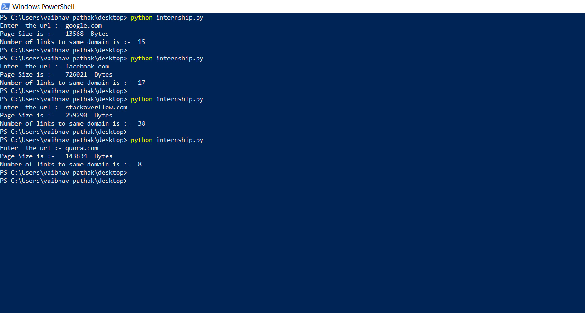

# opengenus_internship_task

  The task of the scripts is to :- 

1- Find the size of the webpage in bytes. 

2- Find the number of links in that page pointing to same domain. 

  Dependencies (Python 2) :- 

1- BeautifulSoup

2- urllib

Execute the code.py file and Enter the url of which you want information and it show result like this

